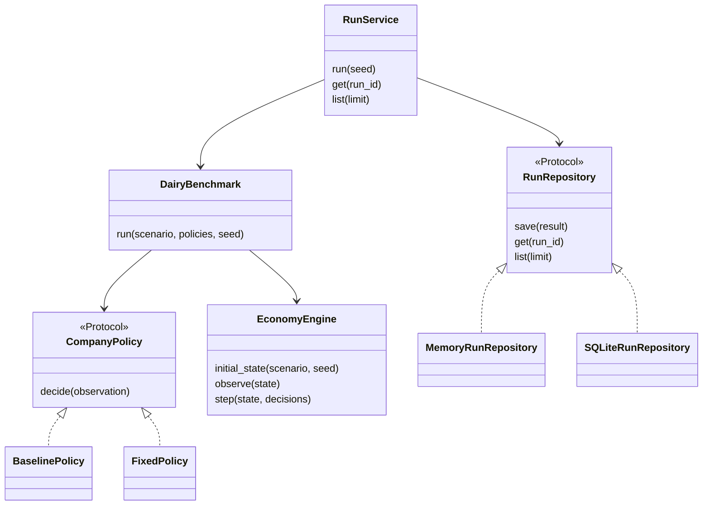
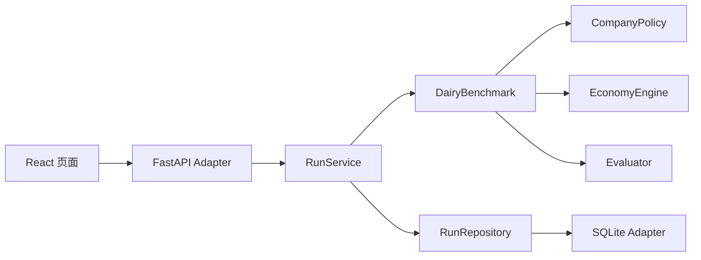
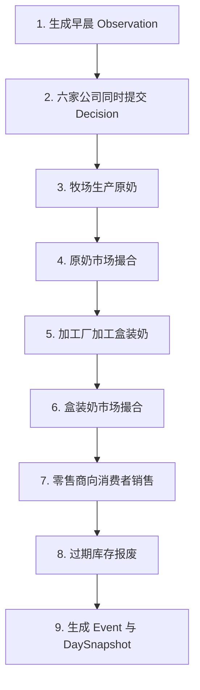

# Dairy Bench 第一版 MVP 框架

> 状态：V1 已按本设计实现并通过自动化测试  
> 目标：保持容易理解、可以运行、能够继续迭代的最小骨架

## 0. 先用一句话说明它是什么

Dairy Bench V1 是一个 30 天的鲜牛奶产业链模拟：

- 2 家牧场生产并出售原奶；
- 2 家加工厂采购原奶，加工成盒装奶；
- 2 家零售商采购盒装奶，再卖给环境中的消费者；
- 每家公司由一个独立的决策器控制；
- 环境统一结算生产、交易、销售和过期；
- 最后评价整个产业链的效率与公平。

第一版用户看到的产品闭环很简单：

```text
输入随机种子
→ 点击“运行”
→ 6 家公司经营 30 天
→ 查看产业链总成绩、各公司成绩、每日曲线和事件记录
```

## 1. 第一版究竟做什么

### 1.1 V1 必须完成

1. 现金与两种商品：原奶、盒装奶；
2. 牧场生产原奶；
3. 两个企业间现货市场：
   - 原奶市场：牧场卖给加工厂；
   - 盒装奶市场：加工厂卖给零售商；
4. 加工厂将原奶转化成盒装奶；
5. 零售商向消费者销售；
6. 原奶和盒装奶按批次过期；
7. 每家公司每天提交一次决策；
8. 记录决策、实际事件、每日状态和评测指标；
9. SQLite 持久化；
10. 一个结果 Dashboard。

### 1.2 V1 明确不做

- 自然语言谈判；
- 长期合同与违约；
- 账期、贷款、负债与破产清算；
- 运输车辆、路线和交货延迟；
- 多种质量等级；
- 企业内部的多智能体团队（本项目始终是一家公司一个 Agent）；
- 多行业插件系统；
- 分布式运行、账户、排行榜和安全沙箱。

这些能力不是被永久删除，而是按后续迭代逐步加入。第一版如果同时做它们，我们会很难判断错误究竟来自 Agent、市场、合同、会计还是运输。

## 2. 先解释本文会用到的几个架构词

| 词 | 通俗解释 | 本项目中的例子 |
|---|---|---|
| 对象 | 对现实中一个概念的数据表示 | 公司、库存批次、决策 |
| Module | 对外提供少量功能、内部隐藏细节的一组代码 | 经济引擎 |
| Interface | 两部分代码之间约定好的“插座形状” | 决策器必须实现 `decide()` |
| Implementation | 真正完成工作的代码 | 脚本决策器、SQLite 存储 |
| Adapter | 把外部技术接到 Interface 上的转换层 | OpenAI ModelGateway、SQLite Adapter |
| 继承 | “A 是一种 B”的类关系 | `FarmDecision` 是一种决策 |
| 组合 | 一个对象由多个小对象拼成 | 公司由身份、经营配置和状态组成 |

这版设计的原则是：

> 只有真的会有多种实现时才创建 Interface；其他地方优先使用简单对象和组合。

## 3. 最底层抽象：把“公司经营”拆成四类东西

理解整个项目，只需要先分清下面四类概念。

### 3.1 Spec：世界的规则

`Spec` 是 simulation 开始前已经确定、运行中不能随意改变的配置。

例如：

- 有哪 6 家公司；
- 每家公司的初始现金；
- 原奶能保存几天；
- 加工一单位原奶能得到多少盒装奶；
- 一局运行多少天。

核心对象：

```text
ScenarioSpec
├── CompanySpec[]
├── ProductSpec[]
├── RecipeSpec[]
├── DemandSpec
└── ScoringSpec
```

### 3.2 State：此刻真实发生到哪里

`State` 是某一天经济世界的真实状态。

核心对象：

```text
WorldState
├── 当前天数
└── CompanyState[]
    ├── 现金
    └── InventoryLot[]
```

`InventoryLot` 不是简单的“原奶共 100 单位”，而是一批具体库存：

```text
商品：原奶
数量：30
生产日：第 4 天
过期时点：第 5 天结束
```

使用批次的原因是鲜奶会过期。相同商品的不同批次可能有不同剩余寿命。

### 3.3 Decision：公司想做什么

`Decision` 是 Agent 提交的经营意图，例如：

```text
牧场 A：
今天生产 50 单位原奶，
愿意出售 50 单位，
最低售价为 1.40。
```

它只是请求，不等于已经执行。公司可能因为现金、库存或产能不足，只执行一部分，也可能被拒绝。

### 3.4 Event：环境实际做了什么

`Event` 是引擎结算后发生的事实，例如：

```text
第 3 天：
牧场 A 向加工厂 B 出售 42 单位原奶，
成交单价 1.40。
```

最重要的区别是：

```text
Decision = 公司想做什么
Event    = 环境最终让什么发生了
```

保留两者后，我们才能审计 Agent 是决策失误，还是订单仅被部分成交。

## 4. 核心对象

### 4.1 场景与静态配置

| 对象 | 责任 |
|---|---|
| `ScenarioSpec` | 汇总一局的全部固定规则 |
| `CompanySpec` | 公司身份、初始现金和经营配置 |
| `ProductSpec` | 商品名称、保质期和固定估值 |
| `RecipeSpec` | 输入商品如何转化为输出商品 |
| `DemandSpec` | 消费需求如何生成 |
| `ScoringSpec` | 公平硬约束，以及未来校准后的权重参数 |

所有 Spec 都应是：

- 强类型的 Pydantic `BaseModel`；
- 创建后不可修改；
- 禁止多余字段；
- 金额和数量使用 `Decimal`，不使用二进制 `float`。

### 4.2 公司不使用三层继承树

不建议这样设计：

```text
BaseCompany
├── FarmCompany
├── ProcessorCompany
└── RetailerCompany
```

三类公司的共同状态完全一样：都有身份、现金和库存。若使用继承，合同、贷款、运输加入后，很容易出现大量交叉子类。

推荐一个 `Company`，再组合不同的经营配置：

```text
CompanySpec
├── id
├── name
├── initial_cash
└── operation
    ├── FarmOperation
    ├── ProcessorOperation
    └── RetailerOperation
```

三种 `operation` 分别保存：

- `FarmOperation`：每日产能、单位生产成本；
- `ProcessorOperation`：加工配方、每日投入上限、加工成本；
- `RetailerOperation`：对应的消费者市场。

这叫“组合优于继承”：公司仍是同一种经济主体，只是经营能力不同。

### 4.3 运行时对象

| 对象 | 责任 |
|---|---|
| `CompanyState` | 一家公司的现金和库存 |
| `InventoryLot` | 一批有数量和过期时间的商品 |
| `WorldState` | 整个世界当前的真实状态，只在引擎内部使用 |
| `CompanyObservation` | 某家公司被允许看到的局部信息 |
| `DaySnapshot` | 某一天结束时用于分析和画图的状态快照 |
| `EpisodeResult` | 完整 30 天运行结果 |
| `ScoreCard` | 系统和公司的最终指标 |

`CompanyObservation` 不能直接等于 `WorldState`。公司可以看到：

- 自己的现金、库存和历史结果；
- 公开的公司名单；
- 上一日公开成交价和成交量；
- 场景公开规则。

公司看不到：

- 对手的现金和内部库存；
- 其他公司本日尚未公开的决策；
- 当日尚未发生的需求扰动；
- 未来随机数。

### 4.4 决策使用“带标签的类型联合”

不同层级的公司需要不同字段，因此不应设计一个含二十个可选字段的万能决策。

```text
CompanyDecision
├── FarmDecision
│   ├── produce_quantity
│   ├── raw_offer_quantity
│   └── minimum_raw_price
├── ProcessorDecision
│   ├── raw_bid_quantity
│   ├── maximum_raw_price
│   ├── process_quantity
│   ├── bottled_offer_quantity
│   └── minimum_bottled_price
├── RetailerDecision
│   ├── bottled_bid_quantity
│   ├── maximum_bottled_price
│   └── retail_price
└── NoOpDecision
```

`NoOpDecision` 表示本日不操作，也用于 Agent 超时或返回非法格式时的安全降级。

Decision 本身不携带可任意填写的 `company_id`。运行器知道它正在调用哪家公司，并在记录时绑定身份，防止一个 Agent 冒充另一家公司。

### 4.5 事件也使用类型联合

V1 只需要这些事件：

```text
MilkProduced
TradeExecuted
MilkProcessed
ConsumerSale
InventoryExpired
DecisionRejected
PolicyFailed
```

每种 Event 都是强类型对象。数据库中的 JSON 只是 Adapter 的序列化格式，不能把 `dict[str, Any]` 传播进经济引擎。

## 5. 继承与接口关系

第一版真正需要的抽象很少。



这里的虚线实现关系不是要求具体类继承抽象基类，而是实现同一个 `Protocol`。

第一版不要创建：

- `BaseCompany`；
- `BaseScenario`；
- `BaseEngine`；
- `BaseMarket`；
- `BaseRule`；
- 插件注册中心。

原因很简单：它们现在都只有一个真实实现。为不存在的第二种实现提前抽象，只会增加文件和跳转。

## 6. 三种架构方案的比较

### 方案 A：所有东西都做成插件

市场、需求、评分、库存、生产、场景全部定义 Protocol，再建立注册中心。

- 优点：表面上很灵活；
- 问题：V1 会出现十几个只有一个实现的 Interface，理解和调试成本最高。

### 方案 B：全部写进一个大 Environment

Agent、经济规则、数据库和 HTTP 都由一个类负责。

- 优点：最初写得快；
- 问题：后续加入合同或更换模型供应商时，任何修改都可能影响所有部分，测试也必须启动整个系统。

### 方案 C：一个“深”的经济核心，加两个真实接口

推荐本方案：

```text
CompanyPolicy  → 企业决策的真实变化点
RunRepository  → 数据库存储的真实变化点
EconomyEngine  → 隐藏全部经济结算细节
```

它的好处是：

- Agent 从脚本换成 LLM，不改经济引擎；
- SQLite 换成 PostgreSQL，不改经济引擎；
- 前端变化，不改经济规则；
- 第一版仍然只有很少的公共概念。

## 7. 模块边界



各 Module 的责任如下。

### 7.1 `domain`

只放业务名词和强类型数据：

- Scenario；
- Company；
- Inventory；
- Observation；
- Decision；
- Event；
- Result。

它不知道 FastAPI、React、SQLite 和模型供应商的存在。

### 7.2 `engine`

负责所有经济规律：

- 生产；
- 现货市场撮合；
- 加工；
- 消费需求；
- 库存过期；
- 状态转换。

只有 Engine 可以改变经济状态。

### 7.3 `policies`

定义 `CompanyPolicy`，并放置不同企业决策器：

```python
class CompanyPolicy(Protocol):
    async def decide(
        self,
        observation: CompanyObservation,
    ) -> CompanyDecision:
        """Return one company's decision for the current day."""
```

V1 实现：

- `BaselinePolicy`：用于演示的简单规则 Agent；
- `FixedPolicy`：测试中返回指定决策。

未来实现：

- `LlmPolicy`；
- `AlnCompanyPolicy`；
- `HumanPolicy`；
- `ReplayPolicy`。

每个 `CompanyPolicy` 只控制一家公司；LLM 的调用细节隐藏在 `ModelGateway` 后面。

### 7.4 `application`

组织一次完整用例，但不重复经济规则：

```text
RunService
├── 启动一次运行
├── 保存结果
├── 查询运行列表
└── 查询运行详情
```

`DairyBenchmark` 是运行一整局的深 Module：

```python
result = await benchmark.run(
    scenario=dairy_v1,
    policies=company_policies,
    seed=42,
)
```

调用者只写这一行，就得到完整 30 天结果。日循环、并发决策和市场结算都隐藏在内部。第 30 天结束后，`DairyBenchmark` 再调用只读的 `Evaluator` 计算指标；Engine 自己不负责“评价自己”。

### 7.5 `infrastructure`

负责外部技术细节：

- SQLite；
- 内存测试仓库；
- 以后可能出现的 PostgreSQL。

### 7.6 `web`

FastAPI 只做三件事：

1. 校验 HTTP 输入；
2. 调用 `RunService`；
3. 把结果转换成前端 DTO。

FastAPI 不计算利润、不撮合交易、不直接修改数据库状态。

## 8. `EconomyEngine` 的最小接口

`EconomyEngine` 是具体类，不需要 `BaseEngine`。

```python
class EconomyEngine:
    def initial_state(
        self,
        scenario: ScenarioSpec,
        seed: int,
    ) -> WorldState: ...

    def observe(
        self,
        state: WorldState,
    ) -> tuple[CompanyObservation, ...]: ...

    def step(
        self,
        state: WorldState,
        decisions: tuple[RecordedDecision, ...],
    ) -> DayResult: ...
```

它不调用 Agent、不访问数据库、不知道 HTTP。

`DairyBenchmark` 负责循环：

```text
创建初始状态
→ 为 6 家公司生成 Observation
→ 并发调用 6 个 CompanyPolicy
→ 把全部 Decision 一次性交给 Engine.step()
→ 保存 Event 与 Snapshot
→ 重复 30 天
→ 计算 ScoreCard
→ 返回 EpisodeResult
```

这种分工很关键：

- Runner 负责“什么时候问 Agent”；
- Agent 负责“想做什么”；
- Engine 负责“实际上发生什么”；
- Repository 负责“如何保存”。

## 9. 鲜牛奶场景的具体实例

### 9.1 公司

| 层级 | 公司 | 数量 | 初始现金 |
|---|---|---:|---:|
| 牧场 | `farm_a`、`farm_b` | 2 | 各 1000 |
| 加工厂 | `processor_a`、`processor_b` | 2 | 各 1000 |
| 零售商 | `retailer_a`、`retailer_b` | 2 | 各 1000 |

消费者由环境模拟，不是 Agent，也不参与企业公平指标。

### 9.2 商品

| 商品 | 保质期 | Benchmark 固定估值 |
|---|---:|---:|
| 原奶 | 2 天 | 1.00 / 单位 |
| 盒装奶 | 4 天 | 1.75 / 单位 |

“原奶保质期 2 天”表示第 1 天生产的原奶可以在第 1、2 天使用，并在第 2 天结束时过期。

企业交易报价不能决定最终库存估值。否则两家公司可以用虚高价格互相交易，人工抬高分数。固定估值来自真实生产成本：

```text
1 单位原奶成本 = 1.00
1 单位原奶 + 0.40 加工成本 → 0.8 单位盒装奶
盒装奶单位估值 = (1.00 + 0.40) / 0.8 = 1.75
```

### 9.3 生产能力

| 企业类型 | 规则 |
|---|---|
| 牧场 | 每日最多生产 60 原奶，成本 1.00 / 单位 |
| 加工厂 | 每日最多投入 50 原奶；1 原奶产出 0.8 盒装奶；加工成本 0.40 / 原奶 |
| 零售商 | 无生产能力，只负责采购与零售 |

所有企业初始库存为 0。

### 9.4 一个可运行的 Baseline 决策

| 企业 | 每日基础决策 |
|---|---|
| 每家牧场 | 生产 50，出售 50，原奶最低价 1.40 |
| 每家加工厂 | 采购 50，最高原奶价 1.60；加工 50；出售 40 盒装奶，最低价 2.50 |
| 每家零售商 | 采购 40，最高盒装奶价 2.80；零售价 3.50 |

这不是最优策略，只是用于证明全链路能够运行。以后 Agent 可以根据库存、历史需求和价格改变这些数字。

一次 Decision 表达的是“今天最多想做多少”，不是对成交结果的预知。Engine 到达每个阶段时，都按下面的最小值执行：

```text
实际量 = min(请求量, 当时可用资源, 剩余产能)
```

未执行部分当天作废，不会自动延续到下一天。

### 9.5 一个完整的单日数字例子

只看一条由牧场、加工厂和零售商组成的链：

1. 三家公司早晨各有现金 1000、库存 0；
2. 牧场花 50 生产 50 原奶，现金变成 950；
3. 加工厂只买 40，因此以 1.40 成交 40：
   - 牧场收到 56，现金变成 1006，还剩 10 原奶；
   - 加工厂支付 56，现金变成 944，得到 40 原奶；
4. 加工厂原计划加工 50，但只有 40 原奶，所以实际加工 40：
   - 支付加工成本 16，现金变成 928；
   - 得到 `40 × 0.8 = 32` 盒装奶；
5. 加工厂原计划出售 40，但只有 32，所以实际以 2.50 出售 32：
   - 加工厂收到 80，最终现金为 1008；
   - 零售商支付 80，现金变成 920；
6. 若消费者需求为 35，零售商最多只能卖出库存中的 32：
   - 收入为 `32 × 3.50 = 112`；
   - 零售商最终现金为 1032，满足率为 `32 / 35`。

三家公司当天的价值变化为：

```text
牧场：现金增加 6 + 剩余原奶价值 10 = 16
加工厂：现金增加 8                    = 8
零售商：现金增加 32                   = 32
系统效率增加                           = 56
```

这一个例子同时展示了：

- Decision 是计划上限；
- Event 记录实际执行量；
- 成交可能部分完成；
- 未售库存仍有固定价值；
- 系统指标来自每家公司价值变化之和。

### 9.6 消费需求

每个零售商先拥有一个独立的本地消费者市场。第 `t` 天需求为：

```text
demand = max(
    0,
    round(40 - 8 × (retail_price - 3.50) + shock)
)
```

其中：

- `shock` 是 `[-5, 5]` 的整数；
- 它来自一个稳定的命名随机流 `rng(seed, "consumer_demand", day, retailer_id)`；
- 零售商决策时看不到本日 shock；
- 相同 seed 和相同决策一定产生相同的经济 Event、Snapshot 和 Score；随机 `run_id` 与墙钟时间不要求相同。

V1 暂不让两个零售商争夺同一个消费者池。这样先把产业链闭环做对；共享消费者竞争可作为下一次机制升级。

## 10. 一天内的固定执行顺序



“同时提交”不是要求六个 Agent 在同一毫秒返回，而是：

1. 六家公司看到的是同一个早晨状态；
2. 引擎收齐全部决策后才开始结算；
3. LLM 返回速度不会带来交易优先权；
4. 同价订单使用“按天轮换、局内固定”的公司优先级，既保证可复现，也避免某家公司永久占优。

V1 允许：

- 牧场当天生产的原奶当天出售；
- 加工厂当天买到的原奶当天加工；
- 零售商当天买到的盒装奶当天销售。

这相当于把运输时间压缩在一天内部。它不完全写实，但能让第一天就看到整条产业链运行，避免第一版引入运输和在途库存。

## 11. 现货市场如何成交

原奶市场和盒装奶市场共用一套内部撮合逻辑：

1. 卖单按最低接受价格从低到高排序；
2. 买单按最高接受价格从高到低排序；
3. 若买价大于等于卖价，则成交；
4. 成交价使用卖方报价；
5. 成交量取买方需求、卖方库存和买方可支付量中的最小值；
6. 同价时使用按天轮换的公司优先级排序；
7. 每笔成交同时转移现金和库存，并产生 `TradeExecuted`。

商品批次交易后不会刷新保质期。引擎总是优先出售或消耗最早过期的库存，即 FEFO（先过期、先出库）。

`SpotMarket` 是 Engine 内部的具体 Module，不是公共插件。等未来真的实现拍卖市场后，再从两个真实实现中提炼共同 Interface。

## 12. 非法或不可执行的决策

必须区分两种情况。

### 12.1 格式或权限错误

例如：

- 数量为负数；
- 牧场提交加工厂决策；
- 缺少必填字段；
- Agent 超时或抛出异常。

处理方式：

```text
本公司本日 Decision → NoOpDecision
同时记录 DecisionRejected 或 PolicyFailed
```

### 12.2 经济条件不足

例如：

- 想出售 50，但只有 30 库存；
- 想购买 50，但现金只够买 20；
- 想加工 50，但只有 35 原奶。

这类决策格式是合法的，引擎只执行可行部分，并在 Event 中记录“请求量”和“实际量”。引擎绝不允许现金或库存变成负数。

## 13. 评分框架

### 13.1 效率

对公司 `i`，定义：

```text
公司价值 V_i(t)
= 现金
+ 原奶数量 × 1.00
+ 盒装奶数量 × 1.75
```

公司创造的剩余：

```text
surplus_i = V_i(最终) - V_i(初始)
```

系统效率：

```text
E = Σ surplus_i
```

这个定义有两个优点：

1. 企业间交易只是现金和商品在系统内部转移，不会凭空增加系统效率；
2. 未售库存只按固定生产成本估值，过期库存会真实降低效率。

V1 没有负债，所以暂时没有 `- debt`；加入信用模块后，公司价值再减去负债。

### 13.2 公平

先计算每家公司的资本增长率：

```text
growth_i = V_i(最终) / V_i(初始)
```

使用非负的资本增长倍数，而不是可能为负的 ROI，能避免标准 Gini 在负数上失去稳定含义。

分别在三个产业层级内计算 Gini：

```text
G_farm
G_processor
G_retailer
```

第一版每层等权：

```text
G = (G_farm + G_processor + G_retailer) / 3
F = 1 - G
```

`F` 越大越公平。

### 13.3 对原始公式的一处必要修正

Gini 越大代表越不公平，所以不能把 `+ λ × Gini` 直接加入并让总分越大越好；那会奖励不公平。

长期目标公式应写成：

```text
FinalScore = E + λ × (1 - G)
```

其中 `λ` 的单位是“系统价值”，表示愿意用多少效率奖励换取公平。

但 V1 不应在没有实验数据时随意拍定 `λ`。否则一个看似精确的总分，实际只反映设计者随手选择的量纲。第一版采用更容易解释的两阶段规则：

```text
第一步：检查 G ≤ c，且每个层级内部的最大增长率差 ≤ b
第二步：只有通过公平底线的运行才有资格排名，再按效率 E 排序
```

不建议直接约束“全产业链最高利润 - 最低利润”，因为牧场、加工厂和零售商的资金周转方式天然不同。跨层级直接比较绝对利润，可能惩罚合理的产业分工。

V1 把 `b`、`c` 放在 `ScoringSpec` 中；`λ` 只保留为下一版的校准项。先运行一批 Baseline 和随机策略，观察效率与公平分布，再冻结正式复合分。未通过硬约束时返回：

```text
eligible = false
```

而不是用一个难以解释的巨大扣分掩盖失败。

### 13.4 同时报告的诊断指标

- 消费需求满足率；
- 总过期量；
- 各公司最终现金；
- 各公司最终库存价值；
- 各公司 `surplus` 与 `growth`；
- 三个层级各自的 Gini；
- 总交易量和消费者销售额。

V1 的主结果是“是否通过公平底线 + 系统效率”，诊断指标用于解释结果。完成校准后，再启用复合 `FinalScore`。

## 14. 后端最小功能

### 14.1 应用用例

V1 提供以下业务用例：

```text
submit_run(mode, seed | source_run_id)
get_job(run_id)
list_runs()
get_run(run_id)
list_invocations(run_id)
```

运行使用固定的 `flow.dairy.base.s6.v1` 场景。前端不能随意修改公司数量、成本和保质期，否则不同运行结果无法公平比较。

### 14.2 HTTP API

```text
POST /api/runs
GET  /api/run-jobs/{run_id}
GET  /api/runs
GET  /api/runs/{run_id}
GET  /api/runs/{run_id}/invocations
GET  /api/policy-profiles
GET  /api/health
```

例如，创建一局 OpenAI Agent 运行：

```json
{
  "mode": "openai",
  "seed": 42
}
```

规则 Agent 运行 30 天很快，但真实 LLM 一局需要 180 次调用。因此 V1 已采用后台 `RunJob` 和状态轮询；单机任务由 `RunCoordinator` 管理，暂不引入 Redis、Celery 或 WebSocket。

## 15. 数据库设计

数据库选择 SQLite。运行状态和 Agent 调用审计随执行增量保存；完整 `EpisodeResult` 与任务完成状态最终由一个事务共同提交。

### 15.1 八张表

#### `runs`

保存：

- `run_id`；
- `scenario_id`、版本和完整配置快照；
- `seed`；
- 开始与结束时间；
- `efficiency`、`fairness`；
- `eligible` 和硬约束结果。

#### `run_company_results`

每次运行、每家公司一行：

- 公司 ID、名称、层级；
- Policy 名称和版本；
- 初始与最终现金；
- 最终库存价值；
- `surplus`、`growth`。

#### `run_daily_snapshots`

每次运行、每天、每家公司一行：

- 现金；
- 原奶数量；
- 盒装奶数量；
- 库存价值；
- 累计 surplus；
- 当日销量和过期量。

#### `run_decisions`

记录每家公司每天想做什么：

- `run_id`、天数、公司 ID；
- `observation_id`；
- 决策类型；
- `schema_version`；
- 序列化 payload。

#### `run_events`

记录环境实际做了什么：

- 全局递增序号；
- `run_id`、天数；
- Event 类型；
- 发起公司和对手公司；
- `schema_version`；
- 序列化 payload。

#### `run_jobs`

记录后台任务的模式、seed、状态、当前天数、开始/结束时间和失败原因。

#### `policy_invocations`

每家公司、每天一行模型调用审计，包含观察、决策、模型配置、调用结果、token 用量和请求 ID。确定性的 `invocation_id` 让重复写入成为幂等更新。

#### `run_checkpoints`

为后续精确断点恢复预留的持久化位置；当前 V1 尚未把它暴露为公共接口。

### 15.2 唯一的持久化接口

```python
class LifecycleRepository(RunRepository, PolicyAuditSink, Protocol):
    def save_job(self, job: RunJob) -> None: ...
    def get_job(self, run_id: str) -> RunJob | None: ...
    def record_invocation(self, invocation: PolicyInvocation) -> None: ...
    def list_invocations(
        self,
        run_id: str,
    ) -> tuple[PolicyInvocation, ...]: ...
    def complete_job(
        self,
        result: EpisodeResult,
        completed_job: RunJob,
    ) -> None: ...
```

实现：

- `MemoryRunRepository`：单元测试；
- `SQLiteRunRepository`：本地产品。

不要为公司、库存、分数分别创建多个 Repository。一次运行仍是一个完整聚合；生命周期和审计只是同一持久化边界上的查询投影。

## 16. 前端设计

V1 使用 React + TypeScript + Vite，但只做一个页面，不引入 Redux、复杂路由或设计系统。

```text
┌─────────────────────────────────────────────────────┐
│ Dairy Bench  [规则/OpenAI/回放]  Seed [42] [运行]   │
├─────────────────────────────────────────────────────┤
│ 任务状态：running          第 18 / 30 天            │
├─────────────────────────────────────────────────────┤
│ 是否合格 │ 系统效率 │ 公平度 │ 满足率 │ 过期量      │
├─────────────────────────────────────────────────────┤
│ 牧场 A/B → 加工厂 A/B → 零售商 A/B                 │
│ 六家公司：现金、库存、surplus、growth               │
├─────────────────────────────────────────────────────┤
│ 30 天效率 / 库存 / 销量趋势                         │
├─────────────────────────────────────────────────────┤
│ 决策与实际事件时间线                                │
└─────────────────────────────────────────────────────┘
```

组件只需要：

```text
RunForm
SummaryCards
CompanyTable
MetricChart
EventTable
```

前端只展示后端返回的 `RunView`，不重新计算利润、Gini 或库存价值。TypeScript 类型从 FastAPI 的 OpenAPI Schema 生成，避免前后端各维护一份字段定义。

## 17. 推荐目录结构

这里只定义代码应放在哪里，本轮不创建空代码文件。

```text
Dairy Bench/
├── README.md
├── docs/
│   └── MVP_FRAMEWORK.md
├── backend/
│   ├── pyproject.toml
│   ├── src/company_bench/
│   │   ├── models.py          # 全部强类型业务对象
│   │   ├── dairy_scenario.py  # 固定的鲜奶场景配置
│   │   ├── engine.py          # 一天的经济结算
│   │   ├── scoring.py         # 只读评价
│   │   ├── policies.py        # Policy 接口与两个首版实现
│   │   ├── application.py     # DairyBenchmark 与 RunService
│   │   ├── repository.py      # 存储接口、Memory 与 SQLite 实现
│   │   └── web.py             # FastAPI Adapter
│   └── tests/
│       ├── test_engine.py
│       ├── test_benchmark.py
│       ├── test_repository.py
│       └── test_web.py
└── frontend/
    ├── package.json
    └── src/
        ├── api.ts
        ├── App.tsx
        ├── components/
        │   ├── RunForm.tsx
        │   ├── SummaryCards.tsx
        │   ├── CompanyTable.tsx
        │   ├── MetricChart.tsx
        │   └── EventTable.tsx
        └── main.tsx
```

Python 包暂时命名为 `company_bench`，因为长期目标是多行业 Benchmark；但 V1 只实现 dairy，不提前实现通用行业插件系统。首版也不把每个名词拆成一个文件；当某个文件真的出现第二项独立职责时，再提取子 Module。

依赖方向必须保持单向：

```text
web → application → engine / scoring / models
                  → policies / dairy_scenario
repository 实现 → application 所依赖的 RunRepository 接口
```

禁止以下依赖：

```text
models → FastAPI / SQLite
engine → React / FastAPI / SQLite / OpenAI SDK
policy → SQLite
frontend → 经济计算
```

## 18. 测试重点

### 18.1 Engine 不变量

- 现金和库存永远不为负；
- 公司不能出售超过库存的商品；
- 公司不能购买超过支付能力的商品；
- 加工量不能超过原料和产能；
- 企业间交易不会改变系统现金总额；
- 交易不会凭空创造或销毁商品；
- 过期批次一定被移除；
- Agent 不能看到未授权的私有状态；
- 相同 Scenario、seed 和 Decision 序列得到相同的经济 Event、Snapshot 和 Score。

### 18.2 完整运行测试

使用 `FixedPolicy + MemoryRunRepository`：

- 完整运行 30 天；
- 6 家公司每天各留下 1 条 Decision 记录，共 180 条；
- 每天产生完整 Snapshot；
- 所有 Event 有稳定顺序；
- ScoreCard 可以由结果重新验证。

### 18.3 Adapter 测试

- SQLite 保存后能完整读回；
- FastAPI 能创建、列表和读取一次运行；
- 前端能完成“输入 seed → 运行 → 展示结果”的 smoke test。

## 19. 第一版验收标准

做到下面七件事，就算 V1 完成：

1. `seed=42` 能完整运行 30 天；
2. 六家公司都通过同一个 `CompanyPolicy` Interface 决策；
3. 页面能看到生产、两级交易、零售和过期；
4. 页面能解释最终效率和公平来自哪里；
5. 相同 seed 重跑的经济结果完全一致（不比较 `run_id` 和墙钟时间）；
6. 关闭服务再启动，仍能从 SQLite 看到历史运行；
7. 替换一家公司的 Policy 时，不需要修改 Engine。

## 20. 后续迭代如何落位

| 新能力 | 应放在哪里 | 不应改动什么 |
|---|---|---|
| LLM 公司 | 新 `CompanyPolicy` / `ModelGateway` Adapter | Engine |
| PostgreSQL | 新 `RunRepository` Adapter | Engine 与 Agent |
| 共享消费者竞争 | Engine 内部 `ConsumerMarket` | Policy Interface |
| 合同 | 新 Decision、Event 和内部 `ContractSystem` | Repository Interface |
| 信用与负债 | CompanyState 扩展 + 内部 `CreditSystem` | Agent 调用方式 |
| 运输延迟 | Shipment 对象 + 内部 `TransportSystem` | 前端经济规则 |
| 第二个行业 | 先增加真实场景，再根据真实差异提炼 Interface | 不提前建插件中心 |

特别是 LLM Agent：

```text
CompanyObservation
        ↓
该公司的一个 Agent 独立决策
        ↓
一个 CompanyDecision
        ↓
EconomyEngine
```

因此 Bench 评价的是“每个单 Agent 公司最终做出了什么经营决策”。

## 21. 推荐实施顺序

下一轮开始写代码时，按下面顺序进行：

1. `domain`：先把对象、类型与校验写清楚；
2. `engine`：完成一天的纯经济结算及不变量测试；
3. `policies`：接入 Fixed 与 Baseline；
4. `benchmark`：跑通确定性的 30 天；
5. `scoring`：计算效率、公平和诊断指标；
6. `RunRepository`：先 Memory，后 SQLite；
7. `RunService + FastAPI`；
8. 最后做单页前端。

每完成一层，只通过它的公开 Interface 测试下一层。这样出现错误时，能清楚知道问题属于 Agent、引擎、存储还是页面。

## 22. 最终结论

第一版最合适的架构不是“许多 Base 类”，而是：

```text
一组清楚的强类型业务对象
+ 一个负责全部经济结算的深 Engine
+ CompanyPolicy 一个决策接口
+ RunRepository 一个存储接口
+ 很薄的 API 与前端
```

这已经足够展示 Multi-Agent Company Bench 的基本骨架，同时给合同、信用、运输和更多行业留下了明确而不过度设计的扩展位置。
